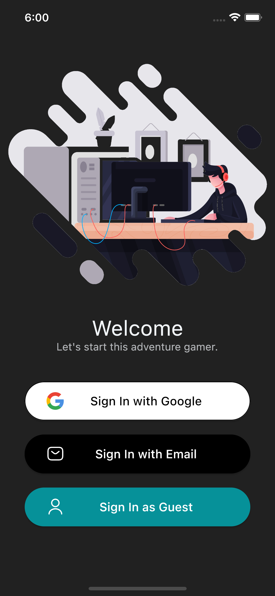
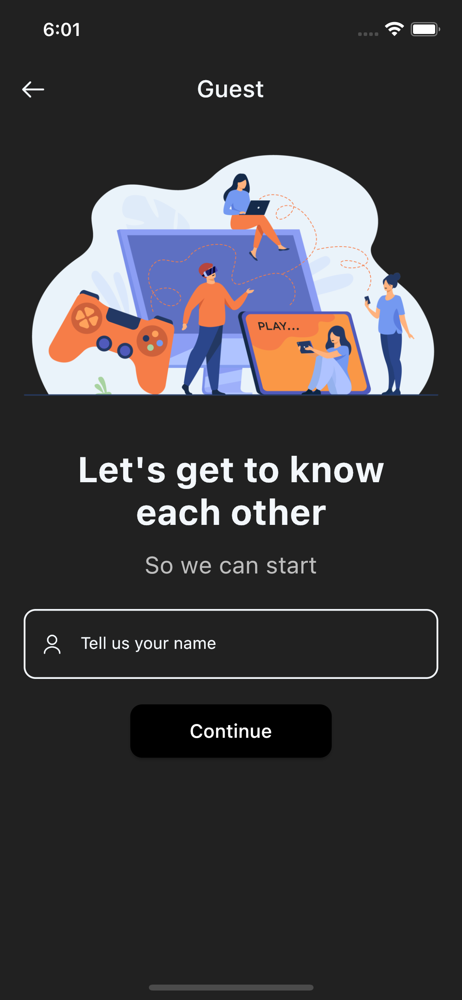
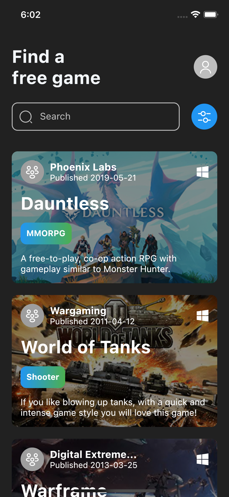
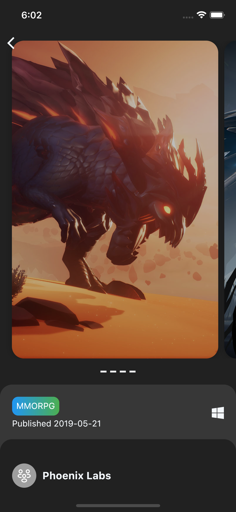
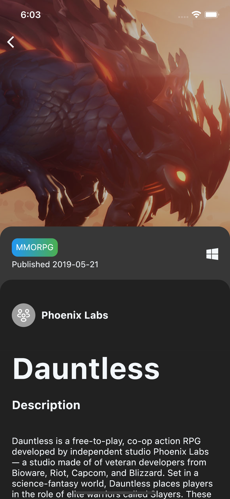
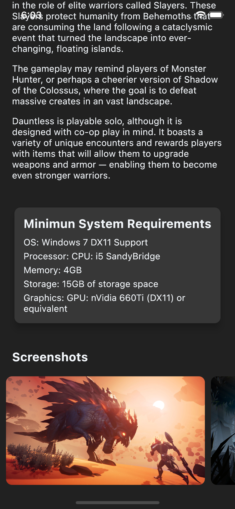
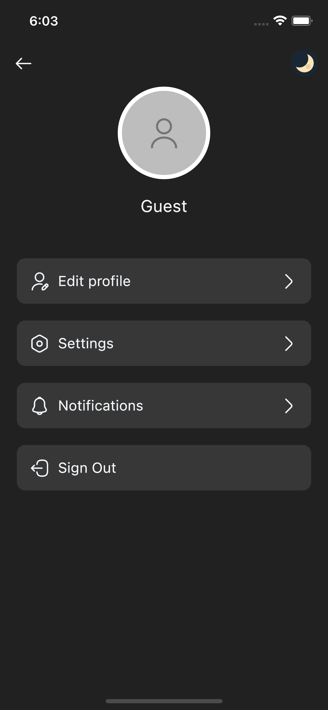
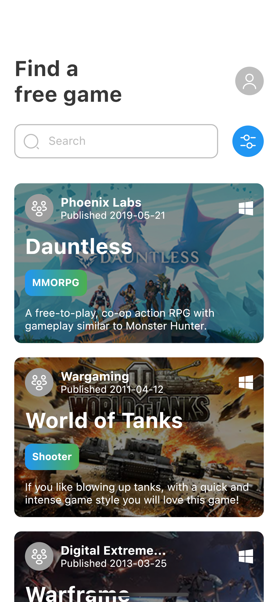

## Recipe App

Flutter Bloc Application with Clean Architecture

## Development Setup
Clone the repository and run the following commands:
```
flutter pub get
flutter run
```

## Screenshots

### OnBoarding Page


### Guest Sign In


### Home


### Detail




### Settings


### Light Mode


## Links
### Api
* [FreeToGame](https://www.freetogame.com/api-doc)
